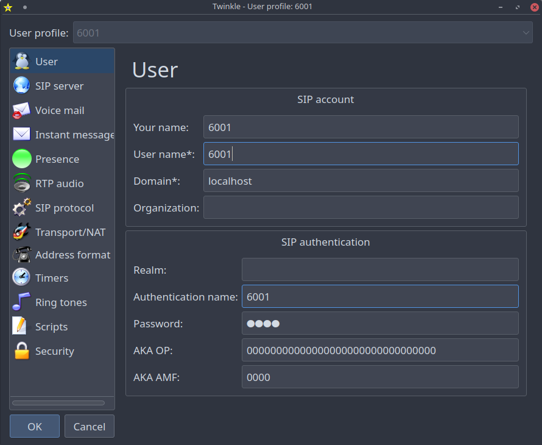
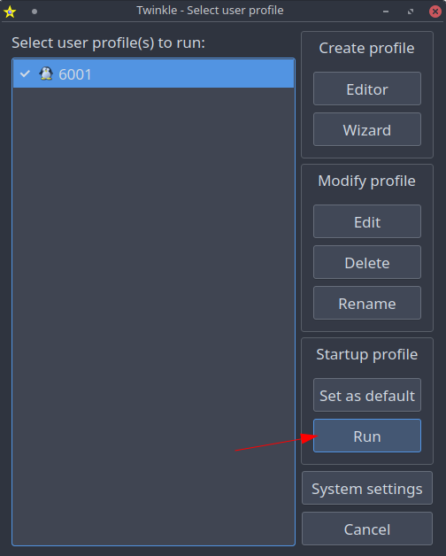

# Local setup
This section will cover the following:
- Local setup of asterisk inside docker container
- Usage of a SIP phone that will connect to the Asterisk server
- Simple configuration necessary for the SIP phone to register itself inside asterisk


## Setup explanation

### Runtime
We chose docker as our runtime engine and we have created `docker-compose.yaml` file where we will define the configuration of the asterisk.

The docker compose file uses [andrius/asterisk](https://hub.docker.com/r/andrius/asterisk/#!) docker image.

Configuration is mounted as a volume. The volume is rewriting the asterisk configuration stored in `/etc/asterisk/`. If you would like to play with the configuration change files in `config` folder.

### Configuration
Configuring asterisk is a complex task. To make this playground simple we will start by minimal configuration where the goal will be to connect our SIP phone to the asterisk.

> Note: We are rewriting the configuration of asterisk, therefore the following files we mention will be the only one used by asterisk.

#### modules.conf

We will copy the default modules file from `../default-files/asterisk/etc/modules.conf` to `config/modules.conf`.
Without the the `modules.conf` file asterisk doesn't start properly:

```log
[May  4 08:53:58]  Asterisk Dynamic Loader Starting:
[May  4 08:53:58] WARNING[1]: config.c:2041 process_text_line: parse error: No category context for line 1 of /etc/asterisk/modules.conf
[May  4 08:53:58] WARNING[1]: loader.c:2240 loader_config_init: 'modules.conf' invalid or missing.
[May  4 08:53:58] ERROR[1]: asterisk.c:4039 check_init: Module initialization failed.  ASTERISK EXITING!
```


## Using SIP phone to connect to the asterisk

I will be trying out [Twinkle](http://twinkle.dolezel.info/)  as a SIP softphone. It's quite old software but for the learning purposes will be enough.

### Configuring asterisk
Asterisk is able to register SIP devices but you need to configure your users in the `pjsip.conf` file. We will be using [pjsip](https://docs.asterisk.org/Configuration/Channel-Drivers/SIP/Configuring-res_pjsip/) since it's recommended and [chan_sip](https://docs.asterisk.org/Configuration/Channel-Drivers/SIP/Configuring-chan_sip/) is deprecated and removed in asterisk 21.

#### pjsip

We will create the configuration file `config/pjsip.conf` and we will setup our user that will be used by the SIP phone.

> Note: This part will be missing a lot of details and explanation. We can cover the registering process later on.

I will be using [documentation examples.](https://docs.asterisk.org/Configuration/Channel-Drivers/SIP/Configuring-res_pjsip/res_pjsip-Configuration-Examples/)

We will try to explain what is going on from a high level perspective.

We need to define a transport protocol that will be used for the SIP communication. We chose SIP we bind it to the localhost (`0.0.0.0`).
```conf
 ;===============TRANSPORT

[simpletrans]
type=transport
protocol=udp
bind=0.0.0.0
```

Then we define a template that is used for each device that can be registered to the Asterisk.

```conf
;===============ENDPOINT TEMPLATES

[endpoint-basic](!)
type=endpoint
context=internal
disallow=all
allow=ulaw

[auth-userpass](!)
type=auth
auth_type=userpass

[aor-single-reg](!)
type=aor
max_contacts=1
```

And then we define each device.

```conf

;===============EXTENSION 6001

[6001](endpoint-basic)
auth=auth6001
aors=6001

[auth6001](auth-userpass)
password=6001
username=6001

[6001](aor-single-reg)

;===============EXTENSION 6002

[6002](endpoint-basic)
auth=auth6002
aors=6002

[auth6002](auth-userpass)
password=6002
username=6002

[6002](aor-single-reg)
```

Source: https://docs.asterisk.org/Configuration/Channel-Drivers/SIP/Configuring-res_pjsip/res_pjsip-Configuration-Examples/#multiple-endpoints-with-phones-registering-to-asterisk-using-templates

#### This configuration means that we can connect to the asterisk with the following credentials:

**User 1:**

- **username**: `6001@localhost`

- **password**: `6001`

**User 2:**

- **username**: `6002@localhost`
- **password**: `6002`


## Usage

### Starting up asterisk
Asterisk runs as a docker container that is configured in the `docker-compose.yaml` file.

Start asterisk with the following command in your command line (if you want to run it in the background use `-d` parameter)

```sh
docker compose up
```

You should see a logs from asterisk that ends with the following line:
```log
asterisk-1  | [May  4 10:43:27] Asterisk Ready.
```
This means that asterisk is ready and we can try connecting with our SIP phone.


### SIP phone connection
We are using Twinkle so the following example will show screenshots of it.
P
Open Twinkle, create your own profile and setup the connection to the asterisk.
- **username**: `6001@localhost`

- **password**: `6001`

The user profile should look like this



Select your profile and run startup profile. This command will try registering you to the asterisk PBX.



When you run it you should see the following log in the asterisk console:

```log
[May  4 19:51:24]     -- Added contact 'sip:6001@127.0.0.1:5063' to AOR '6001' with expiration of 3600 seconds
[May  4 19:51:24]   == Endpoint 6001 is now Reachable
```

This means that you have successfully registered your device to the Asterisk and now you can make calls.

Making calls and dialplan will be explored in the next chapter.
